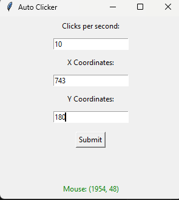

# Auto Clicker

A very basic auto clicker for "clicker" or idle games.

## Features

-   Displays real-time mouse coordinates inside the program
-   Allows you to set custom X/Y coordinates for auto-clicking
-   Moves the mouse to the target area and clicks repeatedly
-   Built-in failsafe: press **F2** to stop the program

## Tech Stack

-   Python
-   Tkinter
-   PyAutoGUI

## How It Works

I wanted a simple way to auto-click on specific areas but couldn’t find one I liked.  
Through trial and error, I built this tool to display coordinates, let me set them, and click automatically.

Instead of PyAutoGUI’s built-in failsafe, I implemented a custom **F2 stop key** for reliability.

## Download
You can download the latest release here:
👉 [Release Page](https://github.com/CozyMeds/Auto_Clicker/releases/tag/v1.0.0)

### Windows Users
- Download the `.exe` file from the latest release  
- Run it directly
- Press **F2** to stop auto-clicking
